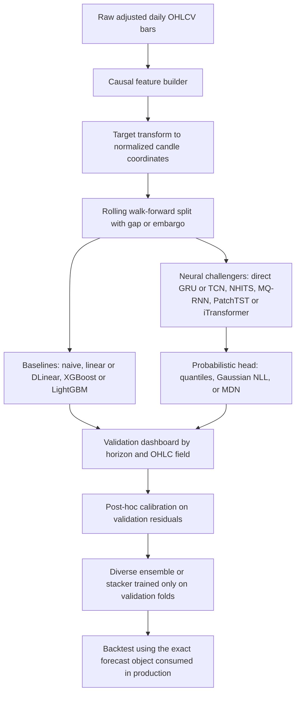
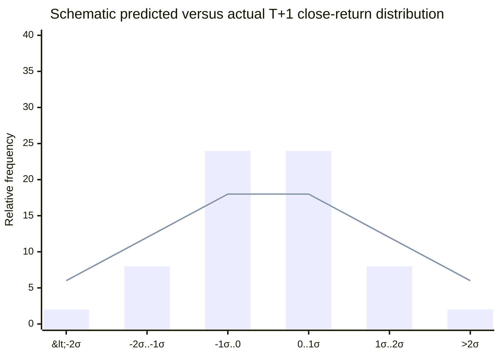
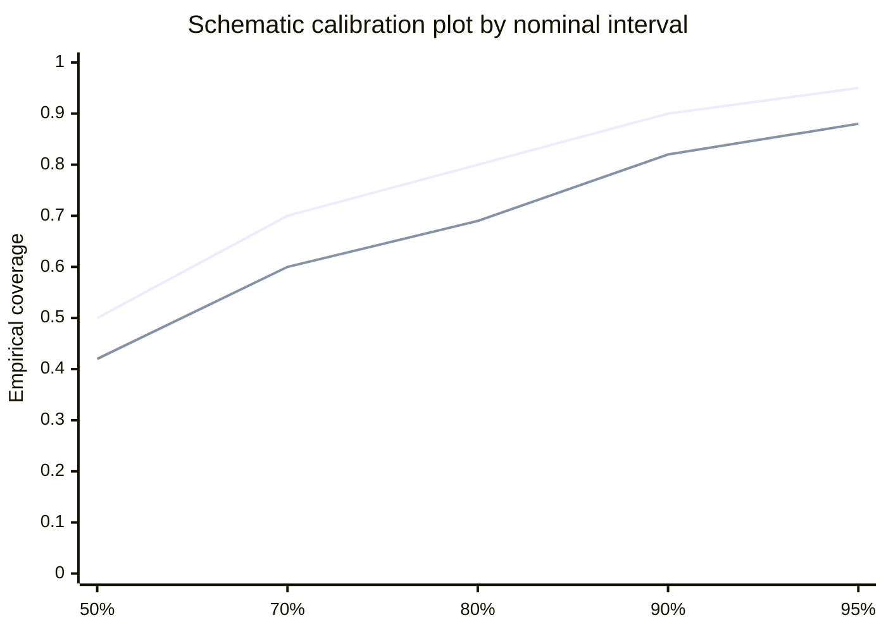

# Deep Research Report on Building a Next-Seven-Day OHLC Predictor for Daily Equities

## Executive summary

For a **next-7-day daily OHLC predictor**, the strongest default is usually **direct multi-horizon forecasting** rather than a purely recursive seq2seq design. The multi-step forecasting literature has long treated recursive and direct strategies as distinct choices with different bias-variance trade-offs, and MQ-RNN is especially relevant here because it combines **direct multi-horizon outputs**, **quantile forecasting**, and a **forking-sequences** training scheme designed to improve stability. Recursive autoregressive models such as DeepAR remain valuable when you truly need joint trajectory generation and have many related series, but they are usually a worse starting point for a **small single-ticker** setting because they compound error across steps and are most compelling when trained globally on **many related time series**. citeturn0search1turn6search0turn0search0turn13search1

Given your stated default regimes, I would use **two different starting stacks**. For a **small single ticker with about 1.4k daily rows**, start with a **naive benchmark**, a **direct linear or DLinear-style baseline**, **XGBoost or LightGBM on lagged candle features**, and then a **small direct GRU or TCN** with either **Huber** or **quantile loss**. For a **panel of 50–500 tickers**, add **global multi-series models** such as **MQ-RNN, NHITS, DeepAR, PatchTST, and iTransformer**, and consider a diverse ensemble only after strong single-family baselines are established. This recommendation is grounded in the direct multi-horizon literature, in DeepAR’s own emphasis on related-series training, in evidence that TCNs can outperform canonical recurrent nets on sequence modeling tasks, and in more recent work showing that simple direct linear forecasting baselines can be surprisingly hard for transformer forecasters to beat on standard benchmarks. citeturn0search1turn0search0turn1search3turn14search0turn14search11

The most important design choice is not the backbone; it is the **problem formulation**. Predicting raw daily price levels for 28 correlated outputs across horizons and OHLC fields creates unnecessary nonstationarity. A better default is to model **transformed candle coordinates** such as returns, gaps, bodies, and wick lengths, ideally normalized by a recent volatility scale or ATR-like statistic, because stationarity and variance stabilization are central issues in forecasting. For uncertainty, use **quantiles**, **Gaussian heads**, or **MDN-style mixture heads** depending on whether you want robustness, calibrated intervals, or multimodal scenario forecasting. Quantile regression comes directly from the regression-quantiles literature, CRPS is a proper score for probabilistic forecasting, and MDNs were explicitly introduced to represent conditional distributions that a single Gaussian cannot represent well. citeturn12search2turn12search16turn8search0turn5search0turn11search1

Evaluation should be **walk-forward**, use a **gap or embargo** when label windows overlap, and report **horizon-by-horizon** point and probabilistic metrics. RMSE and MAE are still useful, but **MAPE is a poor primary metric for returns or vol-normalized targets because values near zero make percentage errors unstable or misleading**. Proper probabilistic evaluation should add **pinball loss or CRPS**, **empirical interval coverage**, and **calibration diagnostics** such as reliability plots or PIT-style checks. Critically, the backtest must use the **same forecast object** the model is judged on: if the trading engine consumes the median quantile path, do not evaluate only the mean path or a temperature-adjusted sampled path. citeturn6search15turn10search0turn15search0turn15search12turn5search0turn5search11turn5search7

Because you have not yet supplied the actual code and data for this task, the report below is an **architecture- and pipeline-level review** rather than a line-by-line code audit. The recommendations are organized so that they can be turned into a rigorous implementation and ablation plan immediately, and then narrowed once your code and artifacts are available.

## Framing the forecasting task

A next-7-day OHLC system should begin by defining the **forecast origin** precisely. If forecasts are generated **after the close of day T**, then day-T OHLCV and any features computed solely from data up through T are fair game, and the targets are the candles for **T+1 through T+7**. If forecasts are generated **before the open of day T**, then the day-T candle itself is not available, and using it would be leakage. This sounds obvious, but in daily-bar equity systems it is one of the most common sources of hidden target leakage because many pipelines are written as if “day T” means the same information set in research and in production.

A second foundational choice is whether to predict **price levels** or **transformed candles**. Forecasting literature consistently emphasizes that nonstationarity and scale variation make raw levels harder to model, while logs and related transformations help stabilize the series. For daily equities, that means the safer default is usually to predict **close-to-close log returns** plus candle-shape coordinates rather than raw future OHLC prices. A practical formulation is to predict, for each horizon, a tuple like `(gap, body, upper_wick, lower_wick)` in volatility-normalized units, then reconstruct OHLC afterward. This gives the model more stationary targets and also makes valid-candle constraints easier to enforce. citeturn12search2turn12search16turn12search13

For a seven-day path, a strong representation is a tensor of shape `[horizon, 4]`, where each horizon stores one normalized candle. The two best default parameterizations are the following. The first is **plain OHLC returns**, for example each of `rOpen, rHigh, rLow, rClose` relative to the prior close. The second, which I prefer for constrained candlestick prediction, is **candle coordinates**: a signed open gap, a signed body, and two nonnegative wick lengths. In the second setup, the model outputs can naturally use **linear or tanh** activations for signed quantities and **softplus** for nonnegative wick magnitudes or dispersion parameters. That reduces the need for brittle post-hoc clipping.

The data regime matters enormously. With roughly **1.4k daily rows** for a single ticker, long lookbacks and high-capacity backbones quickly consume the effective sample size. By contrast, a **50–500 ticker panel** gives global models enough cross-sectional variety to estimate more expressive temporal representations and uncertainty heads. DeepAR’s original formulation is explicitly a **global autoregressive RNN over many related series**, and MQ-RNN’s design likewise assumes a global multi-horizon setup with temporal and static covariates. That is why the best starter architecture is different in the two regimes. citeturn0search0turn13search1turn0search1

The proposed train-to-inference pipeline below is the one I would treat as the reference design before seeing your code.



The logic of this pipeline follows the rolling-origin evaluation literature, proper scoring rules for probabilistic prediction, direct multi-horizon forecasting work, and the original papers behind the candidate model families. citeturn6search15turn10search0turn5search0turn0search1turn1search2turn1search0turn1search1

### Recommended defaults by data regime

The table below synthesizes the cited forecasting literature into practical defaults for your two assumed data regimes. citeturn0search0turn0search1turn1search2turn1search3turn14search0turn17search2turn17search1

| Setting | Best starting objective | Strong first baselines | First neural challengers | Probabilistic default | Ensemble advice |
|---|---|---|---|---|---|
| Small single ticker, about 1.4k rows | Direct T+1..T+7 | Naive persistence, linear or DLinear, XGBoost, LightGBM | Small direct GRU, small TCN, NHITS | Quantiles first, Gaussian second | Use only a small diverse blend |
| Panel of 50–500 tickers | Direct multi-horizon global model | Same baselines per ticker or pooled features | MQ-RNN, NHITS, PatchTST, iTransformer, DeepAR | Quantiles or Gaussian, MDN if clearly multimodal | Stacking becomes much more worthwhile |

## Architecture options and model selection

The key architectural decision is **how the model produces the seven-day path**. The simplest high-quality default is a **direct multi-horizon head** that outputs all seven future candles at once. The reasons are mostly statistical: recursive methods feed predictions back into themselves, so errors accumulate; direct methods avoid that feedback loop; and the multi-step forecasting literature shows that recursive and direct strategies induce different bias-variance trade-offs rather than there being one universally dominant choice. MQ-RNN is especially relevant because it was proposed specifically as a **direct multi-horizon quantile forecaster** for probabilistic sequence prediction, and its forking-sequences training scheme is meant to increase training stability. citeturn0search1turn6search0

Recursive seq2seq still has a role. If the application needs **coherent path simulation**, explicit conditioning on **future known covariates**, or sampling of entire future trajectories, recursive decoders can be attractive. DeepAR is the canonical example: it is autoregressive, recurrent, and distributional, and at prediction time it feeds sampled values back into the network to generate future scenarios. The limitation is that this design is most compelling as a **global model across many related series**, not as a heavyweight default for a lone ticker with limited daily history. citeturn13search2turn0search0turn13search4

Among neural backbones, **LSTM and GRU** remain valid baselines because they are mature, widely supported, and easier to stabilize on small datasets than most transformer stacks. LSTM was introduced specifically to address long-range dependency learning in recurrent networks, and GRU later offered a simpler gated alternative. **TCN** deserves special attention: the empirical TCN literature found that a simple causal convolutional architecture could outperform canonical recurrent networks across diverse sequence tasks while exhibiting longer effective memory. For daily equities, that makes TCN a particularly good early challenger to a small GRU. citeturn2search4turn2search1turn1search3

For direct multi-horizon forecasting, **N-BEATS and NHITS** are among the most attractive general-purpose candidates. N-BEATS uses neural basis expansion for forecasting, while NHITS adds hierarchical interpolation and multi-rate sampling, and its original paper reported both strong long-horizon accuracy and substantial speed advantages over transformer baselines on benchmark datasets. For seven daily horizons, the strongest argument for NHITS is not “state of the art for equities”; it is that it is a **fast, direct, multi-horizon architecture** with a good bias toward structured forecasting rather than raw sequence generation. citeturn0search2turn1search2

Transformer-family models are worth testing, but they should be treated as **challengers rather than defaults**. PatchTST reduces attention cost by tokenizing the history into patches and uses channel independence to let the model attend over longer lookbacks more efficiently, while iTransformer inverts the usual tokenization and attends over variates to learn multivariate relationships. Both are strong general forecasting designs on published benchmarks. But recent work also showed that **very simple direct linear baselines** such as DLinear could outperform many specialized transformer forecasters on standard long-term forecasting datasets. For a small single equity series, that means a transformer should not be the first model you trust unless it clearly beats direct linear, boosted-tree, and small TCN or GRU baselines on rolling-origin validation. citeturn1search0turn1search1turn14search0turn14search11

Classical ML remains essential. Reframing time series prediction as **supervised learning on lagged features** is standard practice, and gradient-boosted trees such as XGBoost and LightGBM are often extremely strong when the dataset is small, structured, and tabular. They also train quickly, are robust to heterogeneous feature scales, and give you a serious non-neural baseline before you invest in more complex temporal models. citeturn10search6turn17search2turn17search1

Finally, ensembles work best when they are **diverse**, not merely averaged seeds of the same backbone. The forecast-combination literature since Bates and Granger has repeatedly shown that combining forecasts can reduce error relative to single constituents, but this benefit is strongest when the members fail differently. In practice, that means an ensemble like `DLinear + XGBoost + TCN + NHITS` is usually more useful than `three slightly different GRUs`. citeturn18search0turn18search12

### Model variant comparison

The comparison below integrates the original papers and official references cited in this section into a practical model-selection view for daily equity OHLC prediction. citeturn0search1turn0search0turn1search2turn1search3turn1search0turn1search1turn14search0turn17search2turn17search1turn18search0

| Variant | Forecasting strategy | Main strengths | Main weaknesses | Best fit |
|---|---|---|---|---|
| Naive, drift, linear, DLinear | Direct | Extremely strong sanity check, fast, low variance | Limited nonlinear interactions | Mandatory in all settings |
| XGBoost or LightGBM | Direct, usually one model per horizon or multi-output wrapper | Excellent on small lagged-feature datasets, fast ablations | No native temporal state, uncertainty needs extra machinery | Small single ticker and mixed tabular setups |
| GRU or LSTM with direct horizon head | Direct | Mature, robust, easy to train, good first neural baseline | Can underuse long history; less parallel than TCN | Small and medium datasets |
| TCN | Direct | Parallel, long effective memory, strong baseline against RNNs | Kernel and dilation choices matter | Small to medium datasets |
| Recursive seq2seq GRU or LSTM | Recursive | Natural path generation, future covariate handling | Exposure bias and error accumulation | Only when path recursion is central |
| MQ-RNN | Direct probabilistic | Built for multi-horizon quantiles; stable forking-sequences training | More complex than plain direct head | Best panel candidate for quantile forecasting |
| DeepAR | Recursive probabilistic global model | Scenario generation, probabilistic output, global training | Most compelling with many related series, not ideal first single-ticker model | Panel of related tickers |
| N-BEATS or NHITS | Direct | Strong general forecasting family, fast, scalable multi-horizon outputs | Less naturally path-sampling-oriented | Excellent default challenger |
| PatchTST or iTransformer | Direct | Good long-lookback handling; strong benchmark evidence | Complexity and overfitting risk on tiny data | Panel or rich multivariate inputs |
| Diverse ensemble | Combination | Often more accurate and more stable than any single model | Easy to overfit stack weights | Final-stage production only |

## Data pipeline, leakage, and scaling

For daily equities, the data pipeline should be treated as part of the model. The first rule is consistency in the **price regime**. Use either **fully adjusted OHLC** or a **fully raw OHLC plus explicit corporate-action handling**, but do not mix adjusted close with unadjusted open, high, or low. Doing so creates synthetic candle shapes that no model can learn honestly. The second rule is that every rolling statistic must be **causal**. Rolling means, volatilities, ATR-like scales, percentile ranks, z-scores, and any regime labels must be computed using information available at the forecast origin only.

Feature engineering should prioritize **candle geometry and market context** rather than raw price. Useful default features include close-to-close return, open gap, intraday body, upper and lower wick size, true range or ATR-like range scale, rolling realized volatility, volume and turnover changes, recent momentum over several windows, and broad-market or sector context if available. Known future covariates can include calendar variables such as day-of-week or month-end indicators. If you move to a panel setting, also include static ticker identities or sector embeddings. The direct multi-horizon global-model literature and the DeepAR and MQ-RNN designs are both built around the idea that covariates and cross-series information matter. citeturn0search0turn0search1

On scaling, I strongly recommend transforming the target into a form that is both more stationary and easier to constrain. A good default is to normalize each horizon’s candle coordinates by a recent scale estimate, such as an ATR-like range or rolling realized volatility. In notation, that means using something like

- `gap_h = (Open_{t+h} - Close_{t+h-1}) / scale_t`
- `body_h = (Close_{t+h} - Open_{t+h}) / scale_t`
- `upper_h = (High_{t+h} - max(Open_{t+h}, Close_{t+h})) / scale_t`
- `lower_h = (min(Open_{t+h}, Close_{t+h}) - Low_{t+h}) / scale_t`

where `upper_h` and `lower_h` are constrained to be nonnegative. This puts all horizons into comparable units and makes it much easier for a single loss to behave sensibly across calm and volatile periods. The forecasting literature’s emphasis on stationarity and variance stabilization strongly supports this general direction, even if the exact volatility scale you choose is application-specific. citeturn12search2turn12search16

Lookback should be selected empirically, not by folklore. For a **single ticker with about 1.4k rows**, I would search **32, 64, and 128 days** first, and use **256** only as a challenger rather than a default. For a **50–500 ticker panel**, search **64, 128, 256, and 512**, especially for TCN, PatchTST, or iTransformer-type models. Long lookbacks can help, but they reduce the number of distinct training windows and increase the risk that the model learns stale regimes rather than persistent structure.

Your validation design must also account for **overlapping labels**. In a T+1..T+7 forecasting problem, adjacent anchors share overlapping target windows, so ordinary random CV is invalid. Use **rolling-origin** evaluation, and when folds are close enough that label windows or lagged features overlap in a harmful way, introduce a **gap or embargo**. Scikit-learn’s `TimeSeriesSplit` formally exposes such a `gap` parameter, and the forecasting literature treats rolling-origin evaluation as the natural analogue of cross-validation for time series. For horizon-7 daily bars, a practical starting point is a gap of **7 trading days**, increased if your features themselves contain long trailing aggregates that could overlap with the validation target region. citeturn10search0turn6search15turn6search3

Label-distribution diagnostics should be first-class artifacts, not afterthoughts. Before training a neural model, inspect the distribution of each horizon’s close return, candle range, body sign, and normalized wick sizes. Do this both overall and stratified by a volatility regime. If you add auxiliary sign or “large move” classification heads, define the classes in volatility-normalized space so that tiny near-zero moves do not dominate the labels and produce a misleadingly balanced but economically uninformative objective.

## Losses, uncertainty, and training mechanics

Loss choice is where many OHLC predictors become either too timid or too unstable. **MSE** is fine as a baseline, but it tends to pull predictions toward the conditional mean and can be particularly conservative when the target is noisy and heavy-tailed. **MAE** is more robust, and **Huber** or **SmoothL1** is often the best first point-forecast loss because it combines stable gradients near zero with reduced sensitivity to outliers. Both PyTorch and TensorFlow expose these losses directly. citeturn8search1turn8search2

If you want intervals, move to **quantile loss** or **Gaussian NLL**. Quantile regression originates in the regression-quantiles literature and is a strong practical choice for multi-horizon forecasting because it produces horizon-specific prediction bands without assuming Gaussian noise. Gaussian NLL is a good second choice when the conditional distribution is roughly unimodal after target transformation. PyTorch provides `GaussianNLLLoss` directly, and TensorFlow’s and TensorFlow Probability’s APIs make Gaussian heads straightforward to implement. citeturn8search0turn3search1turn3search2turn3search14

If you observe genuinely multimodal path behavior, for example “gap up then mean reversion” versus “gap up then continuation,” an **MDN** becomes attractive. Bishop’s original MDN work introduced neural networks that output mixture-distribution parameters specifically so they could represent arbitrary conditional distributions rather than collapsing everything into a single mean and variance. For a seven-day OHLC path, the MDN can either model each output marginally or, more ambitiously, model the entire flattened 28-dimensional future path with an independent or low-rank multivariate component distribution. TensorFlow Probability exposes `MixtureSameFamily` directly, and PyTorch’s `torch.distributions` primitives support the same general construction. citeturn11search1turn3search7turn16search0

Probabilistic models should be judged with **proper scoring rules**, not just with point errors. CRPS is especially important because it rewards both calibration and sharpness, and the probabilistic forecasting literature is explicit that proper scoring rules are the right tools for evaluating predictive distributions. If you use quantile models, weighted pinball loss across several quantiles can serve as a practical approximation target during training, while CRPS can be computed from samples or approximations during validation. citeturn5search0turn5search11

On training mechanics, **AdamW** is the safest default optimizer. The AdamW paper’s central point is that decoupled weight decay is not equivalent to naive L2 regularization in adaptive optimizers, and the official PyTorch and TensorFlow docs both expose AdamW natively. For small, noisy equity datasets, **ReduceLROnPlateau** is usually the best first scheduler because it adapts to validation stagnation; for larger panel runs with predictable training dynamics, **cosine decay** becomes more attractive. SGD should be treated as a challenger rather than the default unless you have a large panel and very stable normalization. citeturn4search0turn3search0turn3search2turn4search1turn7search0turn4search2turn4search3

Regularization should be conservative. On a single ticker, it is usually better to use a **smaller model** than a large model with heavy dropout. A good starting range is **dropout 0.00–0.15**, **weight decay 1e-5 to 1e-4**, **global gradient clipping 0.5–1.0**, and early stopping on a validation score that reflects the true business target. If you are doing direct multi-horizon forecasting, there is **no need for teacher forcing** at all. Teacher forcing and scheduled sampling matter only in recursive decoders. Scheduled sampling was proposed to reduce the train–inference mismatch in sequence prediction, and Professor Forcing was proposed as a more elaborate alternative, but for a direct seven-horizon head the cleanest fix is simply not to recurse. citeturn0search3turn0search15turn7search1turn7search7

Sampling temperature and prediction clipping should be treated as **distribution-shaping tools**, not as patch kits for a mis-specified model. If you sample future paths from a Gaussian or MDN head, temperature can be used to widen or tighten scenarios, but only after calibration, and it should never replace honest validation. Hard clipping of point predictions is almost always a sign that the target transform or uncertainty model is wrong. The exceptions are numerical-stability clips, such as flooring a variance or clipping raw log-scale parameters before a softplus.

### Loss-function comparison

The table below distills the cited literature and official loss documentation into practical choices for daily multi-horizon OHLC forecasting. citeturn8search0turn3search1turn8search2turn11search1turn5search0

| Loss | Learns | Best use | Main failure mode |
|---|---|---|---|
| MSE | Conditional mean | Fast baseline only | Under-dispersed forecasts and tail shrinkage |
| MAE | Conditional median | Robust point forecasts | No calibrated uncertainty output |
| Huber or SmoothL1 | Robust central tendency | Best first point loss for noisy daily bars | Needs delta tuning |
| Quantile or pinball | Conditional quantiles | Best practical interval model | Quantile crossing if unconstrained |
| Gaussian NLL | Mean and variance | Strong unimodal probabilistic baseline | Weak for multimodal outcomes |
| MDN negative log-likelihood | Mixture distribution | Best when scenario distribution is multimodal | Higher variance training, more parameters |
| CRPS | Full predictive distribution score | Validation and model selection | Usually not the simplest training loss |

## Evaluation, calibration, and backtest alignment

Evaluation should be **horizon-specific**, **field-specific**, and tied to the object your downstream system actually uses. You should report **RMSE** and **MAE** at each horizon for at least the close, but for a candle predictor that is not enough. Add **open, high, low, and close MAE/RMSE**, **candle range MAE**, **body sign accuracy**, and the rate at which predicted candles are **structurally valid**. If the model predicts normalized candle coordinates, also report metrics in both normalized space and reconstructed price space. Genuine out-of-sample forecasts must be produced by **rolling-origin evaluation**, not by in-sample residuals. citeturn6search15turn6search11

**MAPE should not be a primary model-selection metric** here. Hyndman and Koehler’s classic review warned that several forecast-accuracy measures become degenerate or misleading in common situations, and they specifically noted that MAPE is problematic when data are close to zero. That problem is especially acute if you are evaluating **returns** or **vol-normalized targets**. If stakeholders insist on seeing MAPE, compute it on reconstructed price levels only, and even then keep RMSE, MAE, and the probabilistic diagnostics as the main scorecard. citeturn15search0turn15search12

For uncertainty, report **pinball loss**, **CRPS**, and **empirical coverage** for central intervals such as 50%, 80%, and 90%. Calibration matters just as much as sharpness. The probabilistic forecasting literature explicitly recommends tools such as calibration plots, proper scoring rules, and PIT-style diagnostics to assess whether predicted distributions are both honest and informative. For regression-style uncertainty, post-hoc calibrated regression and related histogram-based calibration methods are practical ways to improve interval reliability on a held-out calibration set. citeturn5search0turn5search11turn5search7turn5search3

Because your actual forecast arrays are not yet available, the charts below are **schematic**. The first shows the under-dispersion pattern to look for when predicted return distributions are too narrow. The second shows how to visualize interval calibration across nominal coverage levels.





The practical rule for backtest alignment is straightforward. If the strategy re-optimizes daily and primarily uses **T+1**, then train and select models with a scoring rule that **heavily weights T+1**, with smaller but nonzero weight on T+2..T+7. If the strategy genuinely uses the whole week path, then evaluate the whole path, including path-wise uncertainty. Do not let a model win on an aggregate metric if your production decision layer consumes only one horizon or only one field.

### Suggested evaluation thresholds

These are **operational thresholds**, not universal theorems. They are good default targets when you need a disciplined acceptance policy before deploying a daily T+1..T+7 candle forecaster.

| Diagnostic | Suggested target | Interpretation |
|---|---|---|
| 50% interval empirical coverage | 47% to 53% | Wider miss indicates poor calibration |
| 80% interval empirical coverage | 76% to 84% | Strong day-to-day deployment check |
| 90% interval empirical coverage | 86% to 94% | Useful for risk-sensitive scenario use |
| Predicted-candle validity | Above 99.5% | Invalid candles mean the output parameterization is wrong |
| Naive-baseline improvement | Beat naive on at least 5 of 7 close horizons | If not, the model is too complex for the signal |
| Calibration slope by horizon | Roughly 0.9 to 1.1 | Outside this range, recalibration is likely needed |

## Prioritized fixes, experiments, and implementation patterns

The fastest path to a strong system is to make **the simplest correct model hard to beat**. That means building a direct multi-horizon baseline first, then adding uncertainty, then only later adding recursive or transformer complexity. The direct-versus-recursive literature, the DeepAR and MQ-RNN designs, the strong performance of NHITS-class direct models, the evidence for TCN as a powerful baseline, and the long history of forecast combination all point toward the same implementation order. citeturn0search1turn0search0turn1search2turn1search3turn18search0

### Prioritized fixes

| Priority | Fix | Why it matters | Default for small single ticker | Default for panel |
|---|---|---|---|---|
| Highest | Use a **direct T+1..T+7 head** | Removes recursive error accumulation | Yes | Yes |
| Highest | Add a **naive, linear or DLinear, and boosted-tree baseline** | Prevents overestimating deep models | Mandatory | Mandatory |
| Highest | Predict **normalized candle coordinates** instead of raw prices | Improves stationarity and candle validity | Yes | Yes |
| Highest | Use **Huber or quantile loss** before exotic objectives | More robust than plain MSE on noisy data | Huber then quantiles | Quantiles or Gaussian |
| High | Add **rolling walk-forward with gap or embargo** | Avoids leakage from overlapping horizons | Gap 7 to 14 | Gap 7 to 14 or purged folds |
| High | Evaluate with **coverage, CRPS, and calibration**, not only MAE | Prevents under-dispersed intervals from looking good | Yes | Yes |
| High | Keep models **small first** | Sample size is limited | GRU or TCN 64 to 128 hidden | Scale up gradually |
| Medium | Add **NHITS** as the first advanced direct challenger | Strong multi-horizon inductive bias | Yes | Yes |
| Medium | Add **MQ-RNN** if interval quality is central | Direct multi-horizon quantiles are a natural fit | Optional | Strong candidate |
| Medium | Add **DeepAR** only if many related series are available | Best use-case is global autoregressive forecasting | Usually no | Yes |
| Medium | Use **temperature only for scenario generation** | Avoids papering over calibration problems | Yes | Yes |
| Medium | Build **diverse ensembles**, not seed ensembles | Forecast combinations help when models differ structurally | Small blend only | Stacking becomes worthwhile |

### Recommended hyperparameter grids

These are practical starting grids rather than exhaustive search spaces. They reflect the published model families and the differences between small-data and panel-data settings. citeturn1search2turn1search0turn1search1turn4search0turn4search1turn4search3

| Hyperparameter | Small single ticker | Panel of 50–500 tickers |
|---|---|---|
| Lookback | 32, 64, 128, 256 | 64, 128, 256, 512 |
| Hidden size or d_model | 32, 64, 128 | 128, 256, 512 |
| Layers | 1, 2 | 2, 3, 4 |
| Dropout | 0.00, 0.05, 0.10, 0.15 | 0.05, 0.10, 0.15, 0.20 |
| Batch size | 16, 32, 64 | 64, 128, 256, 512 |
| Learning rate | 1e-3, 3e-4 | 1e-3, 5e-4, 3e-4 |
| Weight decay | 1e-5, 1e-4 | 1e-5, 1e-4, 5e-4 |
| Gradient clip | 0.5, 1.0 | 0.5, 1.0, 2.0 |
| Scheduler | ReduceLROnPlateau first | Cosine decay or plateau |
| Epochs | 50 to 200 with early stopping | 20 to 100 with early stopping |
| Quantiles | [0.1, 0.5, 0.9] then [0.05, 0.5, 0.95] | Same |
| Mixture components for MDN | 3, 5 | 5, 8, 10 |
| Teacher forcing | None for direct; 1.0 to 0.2 decay only if recursive | Same |

### Ablation experiments

The ablation plan below is intended to tell you **which modeling choice is actually buying performance**, rather than giving you a single large architecture change that is impossible to diagnose afterward. citeturn0search1turn6search0turn5search0turn18search0

| Experiment | Change | Main metrics | Expected outcome |
|---|---|---|---|
| Baseline set | Naive, linear or DLinear, XGBoost | Close MAE, range MAE | Establish hard-to-beat baseline |
| Loss swap | MSE vs Huber vs quantile | Horizon MAE, pinball, coverage | Huber and quantiles should reduce conservatism |
| Strategy swap | Direct vs recursive | T+1..T+7 RMSE, error growth by horizon | Direct should win on stability |
| Backbone swap | GRU vs TCN vs NHITS | MAE, training time, coverage | TCN or NHITS may beat GRU with less tuning |
| Target swap | Raw returns vs candle coordinates | Valid-candle rate, range MAE | Coordinates should improve structural realism |
| Scaling swap | No scaling vs vol or ATR scaling | Regime-stratified errors | Better stability across calm and volatile periods |
| Uncertainty swap | Quantile vs Gaussian vs MDN | CRPS, coverage, sharpness | MDN only worth it if multimodality is real |
| Calibration layer | None vs post-hoc calibration | Coverage error, interval width | Better coverage with slight width increase |
| Ensemble test | Best single vs diverse blend | Weighted scorecard and stability | Small improvement with lower variance |
| Panel expansion | Single ticker vs related-ticker global training | All metrics, especially coverage | Global models should benefit materially |

### Resource estimates

These are **order-of-magnitude practitioner estimates**, not benchmark numbers from a paper. Assume daily bars, horizon 7, lookback at most 256 for the small case, and one consumer GPU with roughly **12–16 GB VRAM** or an 8-core CPU.

| Variant | Small single ticker training time | Panel training time | Approximate memory footprint |
|---|---|---|---|
| Linear or DLinear | Seconds to under 2 minutes on CPU | Minutes | Less than 1 GB |
| XGBoost or LightGBM | 30 seconds to 5 minutes on CPU | 5 to 30 minutes | 1 to 4 GB CPU RAM |
| Small GRU or LSTM direct head | 2 to 15 minutes CPU or 1 to 5 minutes GPU | 20 minutes to 2 hours | 1 to 4 GB GPU |
| Small TCN | 2 to 20 minutes CPU or 1 to 5 minutes GPU | 20 minutes to 2 hours | 1 to 4 GB GPU |
| NHITS or N-BEATS | 5 to 30 minutes GPU | 30 minutes to 3 hours | 2 to 8 GB GPU |
| MQ-RNN | 5 to 30 minutes GPU | 1 to 4 hours | 3 to 10 GB GPU |
| DeepAR | Usually not worthwhile on single ticker | 1 to 6 hours | 4 to 12 GB GPU |
| PatchTST or iTransformer | 10 to 45 minutes GPU | 1 to 8 hours | 6 to 16 GB GPU |
| MDN head added to any backbone | About 1.3× to 2× the base runtime | About 1.5× to 2.5× | Usually 20% to 60% more than base |
| Diverse ensemble of 3 to 5 models | Sum of members plus calibration time | Sum of members plus calibration time | Sum of members or serialized training |

### PyTorch reference patterns

The patterns below use the official PyTorch optimizer and distribution APIs together with loss choices motivated by the forecasting literature. `AdamW`, `GaussianNLLLoss`, and `torch.distributions` are all part of the native PyTorch stack. citeturn3search0turn3search1turn16search0turn4search1

#### Direct multi-horizon quantile head

```python
import torch
import torch.nn as nn
import torch.nn.functional as F

# y shape: [batch, horizon=7, fields=4]
# output shape: [batch, 7, 4, n_quantiles]

class DirectQuantileGRU(nn.Module):
    def __init__(self, n_features: int, horizon: int = 7, n_fields: int = 4,
                 hidden: int = 128, dropout: float = 0.1,
                 quantiles=(0.1, 0.5, 0.9)):
        super().__init__()
        self.horizon = horizon
        self.n_fields = n_fields
        self.quantiles = quantiles

        self.encoder = nn.GRU(
            input_size=n_features,
            hidden_size=hidden,
            num_layers=1,
            dropout=0.0,
            batch_first=True
        )
        self.head = nn.Sequential(
            nn.LayerNorm(hidden),
            nn.Linear(hidden, hidden),
            nn.GELU(),
            nn.Dropout(dropout),
            nn.Linear(hidden, horizon * n_fields * len(quantiles))
        )

    def forward(self, x: torch.Tensor) -> torch.Tensor:
        _, h = self.encoder(x)          # h[-1]: [batch, hidden]
        out = self.head(h[-1])
        return out.view(-1, self.horizon, self.n_fields, len(self.quantiles))


def pinball_loss(y_true: torch.Tensor, y_pred: torch.Tensor,
                 quantiles=(0.1, 0.5, 0.9)) -> torch.Tensor:
    losses = []
    for idx, q in enumerate(quantiles):
        err = y_true - y_pred[..., idx]
        losses.append(torch.maximum(q * err, (q - 1.0) * err))
    # shape after stack: [n_quantiles, batch, horizon, fields]
    return torch.stack(losses, dim=0).mean()


# Usage notes:
# - Best starter probabilistic head for direct T+1..T+7 forecasting.
# - Replace GRU with TCN, NHITS-style MLP blocks, or Transformer blocks if needed.
```

#### Direct Gaussian NLL head

```python
class DirectGaussianGRU(nn.Module):
    def __init__(self, n_features: int, horizon: int = 7, n_fields: int = 4,
                 hidden: int = 128, dropout: float = 0.1):
        super().__init__()
        self.horizon = horizon
        self.n_fields = n_fields

        self.encoder = nn.GRU(
            input_size=n_features,
            hidden_size=hidden,
            num_layers=1,
            batch_first=True
        )
        self.trunk = nn.Sequential(
            nn.LayerNorm(hidden),
            nn.Linear(hidden, hidden),
            nn.GELU(),
            nn.Dropout(dropout)
        )
        self.mean_head = nn.Linear(hidden, horizon * n_fields)
        self.var_head = nn.Linear(hidden, horizon * n_fields)

    def forward(self, x: torch.Tensor):
        _, h = self.encoder(x)
        z = self.trunk(h[-1])
        mean = self.mean_head(z).view(-1, self.horizon, self.n_fields)
        # GaussianNLLLoss expects variance, not standard deviation.
        var = F.softplus(self.var_head(z)).view(-1, self.horizon, self.n_fields) + 1e-4
        return mean, var


gaussian_nll = nn.GaussianNLLLoss(full=False)

# mean, var = model(xb)
# loss = gaussian_nll(mean, yb, var)

# Usage notes:
# - Good unimodal probabilistic baseline.
# - If you need correlation across outputs, move beyond independent marginals.
```

#### MDN sketch for multimodal futures

```python
import torch.distributions as D

class DirectMDN(nn.Module):
    def __init__(self, n_features: int, horizon: int = 7, n_fields: int = 4,
                 hidden: int = 128, n_mix: int = 5):
        super().__init__()
        self.dim = horizon * n_fields
        self.n_mix = n_mix

        self.encoder = nn.GRU(
            input_size=n_features,
            hidden_size=hidden,
            num_layers=1,
            batch_first=True
        )
        self.trunk = nn.Sequential(
            nn.LayerNorm(hidden),
            nn.Linear(hidden, hidden),
            nn.GELU()
        )
        self.logits_head = nn.Linear(hidden, n_mix)
        self.loc_head = nn.Linear(hidden, n_mix * self.dim)
        self.scale_head = nn.Linear(hidden, n_mix * self.dim)

    def forward(self, x: torch.Tensor):
        _, h = self.encoder(x)
        z = self.trunk(h[-1])

        logits = self.logits_head(z)                                # [B, K]
        loc = self.loc_head(z).view(-1, self.n_mix, self.dim)       # [B, K, D]
        scale = F.softplus(self.scale_head(z)).view(-1, self.n_mix, self.dim) + 1e-4

        mix = D.Categorical(logits=logits)
        comp = D.Independent(D.Normal(loc=loc, scale=scale), 1)
        dist = D.MixtureSameFamily(mix, comp)
        return dist


# dist = model(xb)
# y_flat = yb.view(yb.size(0), -1)
# loss = -dist.log_prob(y_flat).mean()

# Usage notes:
# - Use only if a single Gaussian is clearly too restrictive.
# - Start with 3 or 5 mixture components before trying anything larger.
```

#### Minimal PyTorch training loop

```python
model = DirectQuantileGRU(n_features=X_train.shape[-1], hidden=128, dropout=0.1)
optimizer = torch.optim.AdamW(model.parameters(), lr=1e-3, weight_decay=1e-4)
scheduler = torch.optim.lr_scheduler.ReduceLROnPlateau(
    optimizer, mode="min", factor=0.5, patience=5
)

for epoch in range(100):
    model.train()
    for xb, yb in train_loader:
        optimizer.zero_grad(set_to_none=True)
        pred = model(xb)
        loss = pinball_loss(yb, pred)
        loss.backward()
        torch.nn.utils.clip_grad_norm_(model.parameters(), max_norm=1.0)
        optimizer.step()

    model.eval()
    with torch.no_grad():
        val_loss = 0.0
        for xb, yb in val_loader:
            pred = model(xb)
            val_loss += pinball_loss(yb, pred).item()
    scheduler.step(val_loss)
```

The training choices above follow the official optimizer and scheduler APIs and the rationale behind direct multi-horizon forecasting. citeturn3search0turn4search1turn0search1

### TensorFlow reference patterns

The TensorFlow equivalents below use the official Keras `AdamW` optimizer and, for mixture models, TensorFlow Probability’s distribution layers and `MixtureSameFamily`. citeturn3search2turn7search0turn3search7turn3search14

#### Direct multi-horizon quantile head

```python
import tensorflow as tf
from tensorflow import keras

def build_quantile_model(lookback: int, n_features: int,
                         horizon: int = 7, n_fields: int = 4,
                         hidden: int = 128, dropout: float = 0.1,
                         quantiles=(0.1, 0.5, 0.9)) -> keras.Model:
    inputs = keras.Input(shape=(lookback, n_features))
    x = keras.layers.GRU(hidden)(inputs)
    x = keras.layers.LayerNormalization()(x)
    x = keras.layers.Dense(hidden, activation="gelu")(x)
    x = keras.layers.Dropout(dropout)(x)
    outputs = keras.layers.Dense(horizon * n_fields * len(quantiles))(x)
    outputs = keras.layers.Reshape((horizon, n_fields, len(quantiles)))(outputs)
    return keras.Model(inputs, outputs)

def make_pinball_loss(quantiles=(0.1, 0.5, 0.9)):
    qs = tf.constant(quantiles, dtype=tf.float32)

    def loss(y_true, y_pred):
        # y_true: [B, H, F]
        # y_pred: [B, H, F, Q]
        err = tf.expand_dims(y_true, axis=-1) - y_pred
        q = tf.reshape(qs, (1, 1, 1, -1))
        return tf.reduce_mean(tf.maximum(q * err, (q - 1.0) * err))

    return loss

model = build_quantile_model(lookback=64, n_features=32)
model.compile(
    optimizer=keras.optimizers.AdamW(
        learning_rate=1e-3, weight_decay=1e-4, global_clipnorm=1.0
    ),
    loss=make_pinball_loss((0.1, 0.5, 0.9)),
)
```

#### Direct Gaussian NLL head

```python
def build_gaussian_model(lookback: int, n_features: int,
                         horizon: int = 7, n_fields: int = 4,
                         hidden: int = 128, dropout: float = 0.1) -> keras.Model:
    inputs = keras.Input(shape=(lookback, n_features))
    x = keras.layers.GRU(hidden)(inputs)
    x = keras.layers.LayerNormalization()(x)
    x = keras.layers.Dense(hidden, activation="gelu")(x)
    x = keras.layers.Dropout(dropout)(x)
    outputs = keras.layers.Dense(horizon * n_fields * 2)(x)
    outputs = keras.layers.Reshape((horizon, n_fields, 2))(outputs)
    return keras.Model(inputs, outputs)

def gaussian_nll_loss(y_true, y_pred):
    loc = y_pred[..., 0]
    raw = y_pred[..., 1]
    scale = tf.nn.softplus(raw) + 1e-4
    var = tf.square(scale)
    return tf.reduce_mean(0.5 * (tf.math.log(var) + tf.square(y_true - loc) / var))

gauss_model = build_gaussian_model(lookback=64, n_features=32)
gauss_model.compile(
    optimizer=keras.optimizers.AdamW(
        learning_rate=1e-3, weight_decay=1e-4, global_clipnorm=1.0
    ),
    loss=gaussian_nll_loss,
)
```

#### MDN sketch with TensorFlow Probability

```python
import tensorflow_probability as tfp
tfd = tfp.distributions

def build_mdn_model(lookback: int, n_features: int,
                    horizon: int = 7, n_fields: int = 4,
                    hidden: int = 128, n_mix: int = 5) -> keras.Model:
    dim = horizon * n_fields

    inputs = keras.Input(shape=(lookback, n_features))
    x = keras.layers.GRU(hidden)(inputs)
    x = keras.layers.LayerNormalization()(x)
    x = keras.layers.Dense(hidden, activation="gelu")(x)

    logits = keras.layers.Dense(n_mix, name="mix_logits")(x)
    loc = keras.layers.Dense(n_mix * dim, name="mix_loc")(x)
    loc = keras.layers.Reshape((n_mix, dim))(loc)

    raw_scale = keras.layers.Dense(n_mix * dim, name="mix_scale")(x)
    raw_scale = keras.layers.Reshape((n_mix, dim))(raw_scale)

    return keras.Model(inputs, [logits, loc, raw_scale])

def mdn_nll(y_true, outputs):
    logits, loc, raw_scale = outputs
    scale = tf.nn.softplus(raw_scale) + 1e-4

    mix = tfd.Categorical(logits=logits)
    comp = tfd.Independent(
        tfd.Normal(loc=loc, scale=scale),
        reinterpreted_batch_ndims=1
    )
    dist = tfd.MixtureSameFamily(
        mixture_distribution=mix,
        components_distribution=comp
    )

    y_flat = tf.reshape(y_true, (tf.shape(y_true)[0], -1))
    return -tf.reduce_mean(dist.log_prob(y_flat))

# Usage notes:
# - Easiest to train in a custom train_step or subclassed keras.Model.
# - Treat this as a sketch, not the first model to productionize.
```

#### Minimal TensorFlow training recipe

```python
callbacks = [
    keras.callbacks.EarlyStopping(
        monitor="val_loss", patience=10, restore_best_weights=True
    ),
    keras.callbacks.ReduceLROnPlateau(
        monitor="val_loss", factor=0.5, patience=5, min_lr=1e-6
    ),
]

model.fit(
    train_ds,
    validation_data=val_ds,
    epochs=100,
    callbacks=callbacks,
)
```

The Keras optimizer and callback choices above follow the official TensorFlow APIs, which explicitly support AdamW, learning-rate schedules, and `ReduceLROnPlateau`. citeturn3search2turn7search0turn7search1turn7search2

## Open questions and limitations

This report is intentionally rigorous about the **strategy space**, the **loss design**, and the **validation logic**, but it is not yet a code audit. Without your concrete code, data schema, and current backtest outputs, I cannot verify whether your existing implementation has specific problems such as target leakage, inconsistent adjusted prices, hidden clipping, recursive train–test mismatch, or evaluation metrics that are misaligned with the trading decision layer.

Two other limitations matter. First, the strongest architecture papers cited here were mostly evaluated on **general time-series benchmarks**, not specifically on daily equity OHLC forecasting, so their results should be treated as architecture evidence, not as a guarantee of outperformance on a noisy financial series. Second, the resource estimates are deliberately labeled as **order-of-magnitude practitioner estimates** because exact training times depend heavily on feature count, lookback choice, batching policy, and hardware. Even so, the main high-confidence conclusion is stable: for a next-7-day daily candle predictor, the best starting point is usually **direct multi-horizon forecasting on transformed candle targets, validated with rolling-origin splits and judged with both point and probabilistic metrics**, with recursive/global/probabilistic families introduced only when the data regime actually supports them.