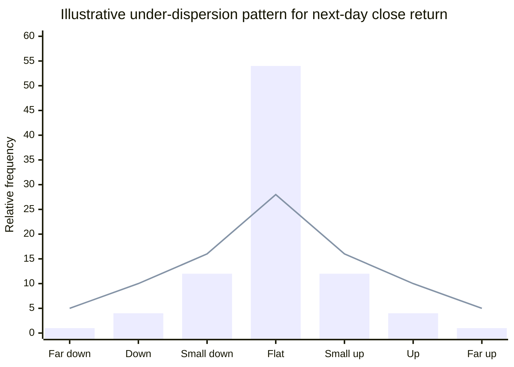
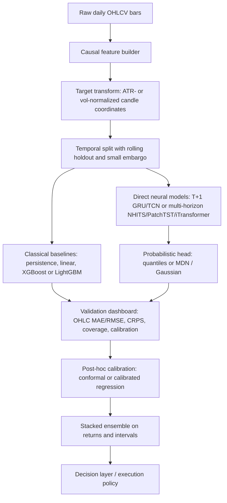
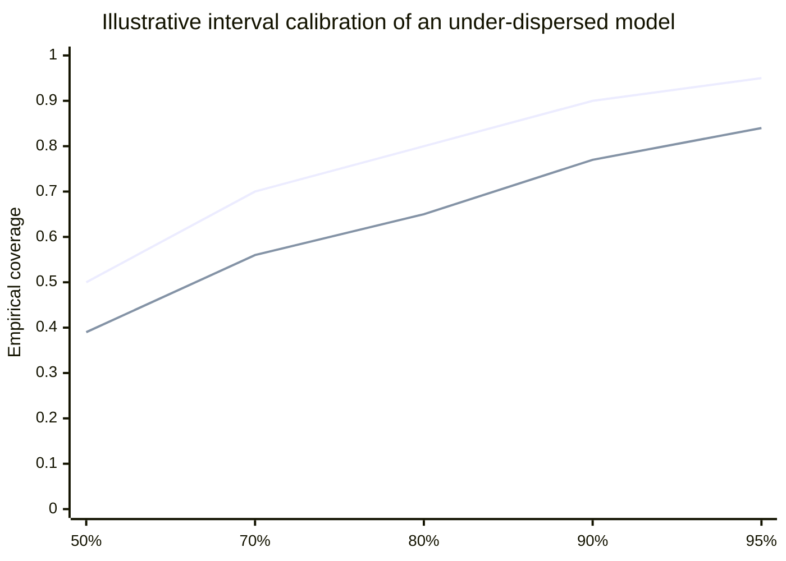

# Deep Research Report on the One-Day Candlestick Predictor

## Executive summary

This review is based on the uploaded training and inference notebooks rather than the underlying artifact directory or raw prediction arrays. Even with that limitation, the main reason your forecasts look overly stable and conservative is unusually clear: the current system is not a dedicated next-day candle model. It is a **7-day**, **recursive**, **GRU-based** ensemble trained on a relatively small, single-symbol daily dataset, and then further smoothed at inference by **trend-matching path selection**, **retrieval blending**, and **global expert averaging**. In short, the pipeline is structurally biased toward consensus-like, low-amplitude forecasts. fileciteturn0file1 fileciteturn0file0

The most consequential code-level issues are not subtle. The training objective gives **later horizons more weight than day one**; the custom `directional_penalty` can be driven to **zero by predicting a zero close return**; the `volatility_match_loss` uses the **cross-sectional standard deviation of OHLC values inside each candle**, which is not the same thing as predictive uncertainty; and the deployed forecast path is chosen from stochastic samples by explicitly matching the recent trend slope. All of those mechanisms reward caution, smoothness, and continuity. fileciteturn0file1 fileciteturn0file0

A second problem is objective mismatch. Your evaluation and ensemble weighting mostly optimize **close-path MAE** and **directional accuracy**, while the model itself predicts full OHLC candles. Open, high, low, wick geometry, interval coverage, calibration, and probabilistic sharpness are largely invisible to the current scoring loop, so an under-dispersed candle forecaster can still score acceptably. Proper probabilistic forecasting practice instead uses metrics such as CRPS, interval coverage, and calibration diagnostics in addition to point-error metrics. fileciteturn0file1 citeturn4search2turn5search0turn9search1

The good news is that I do **not** see obvious gross future leakage in the candle-feature construction itself. The windows are causal, regime thresholds are shifted, and the production backtest trains pre-cutoff and rolls forward on a held-out tail segment. So this does not look like a leakage-driven mirage. It looks like an **under-reactive modeling design**. The fastest route to improvement is to make **T+1** the first-class target, remove the two problematic auxiliary losses, separate **point forecasting** from **scenario generation**, and upgrade the evaluation stack to include **OHLC-specific** and **probabilistic** diagnostics. fileciteturn0file1

| Main diagnosis | Why it suppresses forecast amplitude |
|---|---|
| The system optimizes a 7-day recursive path, not a pure T+1 candle | Day-one sharpness is diluted by later-horizon smoothing |
| All active experts are GRU-family models | Low ensemble diversity makes averaging mostly a shrinkage device |
| The loss function contains two problematic auxiliary terms | Predicting “small move” often becomes the easiest way to reduce loss |
| Inference selects trend-consistent samples and averages them | Continuity is rewarded more than jump risk |
| Metrics are close-centric and not probabilistic | Under-dispersion is not adequately penalized |

The table above is distilled from the uploaded notebooks. fileciteturn0file1 fileciteturn0file0

## What the current code is actually doing

The current stack is best understood as a **daily multi-horizon forecast system** with a downstream trading policy, not as a narrowly optimized next-day candle predictor. The training notebook fixes `HORIZON = 7`, uses AdamW, ReduceLROnPlateau, dropout 0.20, hidden size 256, gradient clipping at 1.0, and teacher-forcing decay of 0.95 per epoch. The active experts are v8.5 with a 64-bar lookback on core features, v9.2 with a 256-bar lookback on regime features, and v9.5 with a 256-bar lookback plus retrieval logic. The inference notebook then loads those experts and shows final ensemble weights concentrated heavily in v9.5 at about **0.728**, versus about **0.164** and **0.108** for the other two. fileciteturn0file1 fileciteturn0file0

The ensemble is also less diverse than its version names initially suggest. The code defines GRU, GRU-with-retrieval, and a hybrid iTransformer-GRU class, but the **active specs** only use GRU-family experts; the hybrid iTransformer path is present in code yet not deployed in the active forecast list. That matters because averaging genuinely different model families can improve robustness, while averaging near-variants of the same backbone usually reduces variance more than it adds orthogonal signal. fileciteturn0file1

The PPO layer is downstream of the forecaster. The training notebook explicitly says the policy is trained **on top of the aggregate daily forecast stream**, and the inference notebook likewise loads the frozen forecast artifacts, builds the aggregate forecast, and then runs the saved decision layer on top. So the forecast conservatism should be fixed **before** revisiting PPO. fileciteturn0file1 fileciteturn0file0

| Component | Current implementation | Why it matters |
|---|---|---|
| Forecast target | Seven-step OHLC return path | Not aligned with a pure one-day business objective |
| Backbone | Three active GRU-family experts | Low architectural diversity |
| Output head | Linear `mu_head` and linear `log_sigma_head` with clamp on log σ | Unimodal, factorized probabilistic view |
| Training loss | Gaussian NLL + range loss + “volatility match” + directional penalty | Strong bias toward average-looking paths |
| Decoder regime | Recursive seq2seq with teacher forcing during training | Exposure-bias risk for multi-step rollout |
| Inference | Sample multiple paths, then pick trend-consistent candidate | Explicitly continuity-preserving |
| Retrieval | Weighted average of nearest historical future-return paths for v9.5 | Another smoothing operator |
| Aggregation | Global reliability-weighted average on price paths | Pulls extremes toward consensus |
| Final guards | Most hard guards disabled; aggregate shrink = 1.00 | Final clipping is not the main culprit |

The table summarizes the implementation visible in the uploaded notebooks. fileciteturn0file1 fileciteturn0file0

## Why the forecasts are overly stable and conservative

The first root cause is **problem-statement mismatch**. A model trained to minimize error on a seven-step recursive path is not automatically a good one-step candle model, especially when the loss explicitly weights later steps more heavily via a linearly increasing 1→2 schedule. If your real decision problem is “predict tomorrow’s candle,” then the current objective is paying a large optimization tax for days two through seven, and that naturally encourages smooth, low-volatility sequences over sharp day-one reactions. Direct multi-step forecasting and direct-horizon quantile models were proposed precisely to avoid some of the instability and mismatch of recursive decoding. fileciteturn0file1 citeturn7search3turn9search0

The second root cause is the **loss design**. The `directional_penalty` is `relu(-(pred_close * true_close)).mean()`. That means a predicted close return of exactly **zero** produces **zero penalty**, regardless of the true sign. In a dataset with many small daily moves—as is common in next-day equity returns—that gives the model an easy escape hatch: predict a tiny move, avoid sign punishment, and let the other loss components dominate. This is a direct mathematical property of the code, not a speculative modeling concern. fileciteturn0file1

The `volatility_match_loss` is even more problematic. It computes `pred_sigma = exp(log_sigma).mean(dim=-1)` and compares it to `true_vol = target.std(dim=-1)`. Because the last tensor dimension is the **OHLC dimension**, `true_vol` is the within-candle spread across open/high/low/close returns, not the time-series volatility of the forecast error or the next-day return process. In other words, the term called “volatility” is actually teaching σ to mimic **candle geometry**, while candle geometry is already being pushed by the separate `candle_range_loss`. This is likely to distort predictive scale and worsen calibration. fileciteturn0file1

The third root cause is **inference-time shrinkage by construction**. For each expert, the code samples multiple candidate paths, optionally blends in a retrieved future-return trajectory, and then chooses the single candidate whose close-path slope is closest to the recent slope after an optional same-sign screen. That is a strong continuity prior. It is not merely “sampling uncertainty”; it is **searching for a trend-respecting path**. After that, the system averages the experts together on the price path itself, which further compresses bodies and wicks. Since Gaussian heads model targets as Gaussian distributions around a learned mean, and mixture models are specifically motivated by the need to represent richer conditional distributions than one Gaussian can represent, the current pipeline is doubly incentivized to produce average-looking outcomes. fileciteturn0file1 fileciteturn0file0 citeturn11search2turn4search4

The fourth root cause is **ensemble diversity that is lower than it looks**. You are not averaging an LSTM, a TCN, a transformer, and a tree-based model. You are averaging three closely related GRU-style experts, one of which dominates the weight vector and one of which adds retrieval-based averaging. That tends to reduce forecast variance more than it improves structural error. Strong forecasting ensembles usually work best when members fail differently, not when they share most of the same backbone assumptions. fileciteturn0file1 fileciteturn0file0

The fifth root cause is **training/evaluation/deployment inconsistency**. The training notebook’s walk-forward selector computes trend on `historical_closes[trend_lookback_bars:]`, whereas the inference notebook uses the last `trend_lookback_bars`. The walk-forward loop also does **not** pass a retrieval artifact into the RAG expert, but production/rolling inference does. And the rolling backtest inside training uses `daily_temperature() = 1.0`, while the saved inference configuration later uses 1.5 in deployment. Those inconsistencies mean the validation statistics used to derive expert weights are only an imperfect proxy for how the deployed system actually behaves. fileciteturn0file1 fileciteturn0file0

The sixth root cause is simply **too little data for too much machinery**. The inference notebook snapshot shows only about **1,442** daily rows for MSFT. With 256-step lookbacks, a held-out rolling tail, and batch sizes of **256**, the long-lookback experts get only on the order of **a thousand** pre-holdout anchors and roughly **4–5 optimizer updates per epoch** on the production split. That is very little optimization signal for a 2-layer seq2seq GRU with probabilistic heads. On small tabular or single-series datasets, classical boosted trees and smaller direct models are often stronger baselines than large recursive sequence models, while models like DeepAR were explicitly designed to learn from **many related series** rather than one ticker alone. fileciteturn0file1 fileciteturn0file0 citeturn7search0turn7search1turn3search3

One thing that is *not* the main culprit is final hard clipping. In the inference notebook, aggregate shrink is 1.00 and most swing, envelope, candle-range, and temporal guards are disabled. The system still looks conservative because the conservatism is already upstream in the objective, the inference selector, and the ensemble design. fileciteturn0file0

*The chart below is schematic rather than empirical, because the saved rolling prediction arrays were not included in the uploaded materials. It shows the qualitative pattern I would expect from the current code path: bars are model forecasts and the line is realized distribution.*



## Data, leakage, scaling, and stationarity

On data preprocessing, the notebooks do several things correctly. Daily bars are sorted chronologically, duplicates are dropped, missing price fields are forward/back-filled, missing count fields are zero-filled, and windows are built causally from `anchor - lookback : anchor` while the targets begin at `anchor`. The regime indicator is based on rolling quantiles shifted by one bar. That is all broadly consistent with causal forecasting and does **not** suggest obvious direct target leakage. fileciteturn0file1

The core target representation is also sensible. The system predicts `rOpen`, `rHigh`, `rLow`, and `rClose` as log returns relative to the previous close, and most core inputs are also returns or relative changes. That is much better for stationarity than predicting raw price levels directly; logs and differenced/log-relative series are a standard way to stabilize variance and remove scale trends. The part I would change is that only **inputs** are standardized. There is no target scaler, and the regime expert includes raw `atr_14` in price units, which reintroduces level dependence. ATR-normalized or robustly standardized targets would make the loss less regime-sensitive and better aligned with daily move magnitudes. fileciteturn0file1 citeturn10search0turn10search1

The larger issue is the **statistical thinness** of the validation design. The notebook uses only two overlapping walk-forward slices, caps validation windows at 192 per slice, and then evaluates a final rolling period of 60 bars. That is far better than having no holdout at all, but it is still small for stable model ranking, especially when the horizon is 7 and adjacent evaluation anchors share overlapping future paths. In addition, the validation and rolling summaries are close-centric; they do not test whether highs, lows, and candle ranges are realistic. fileciteturn0file1

I did not find explicit diagnostics for **label distribution**, **class imbalance**, or **stationarity drift** in the notebooks themselves. For a one-day candle model, those are essential. You should at minimum examine the histogram of `rClose`, the distribution of absolute move magnitudes, regime-stratified candle ranges, directional balance after excluding tiny moves, and drift in median/variance over time. A large mass near zero would make the current directional penalty especially harmful, because “predict almost nothing” becomes even more attractive. fileciteturn0file1

MAPE belongs only in a very limited, stakeholder-facing role here. Daily return targets cluster near zero, and percentage-based error measures are known to behave poorly when actual values are small. If you report MAPE, compute it on **price levels**, not on raw returns; for model selection, basis-point MAE/RMSE on returns and CRPS/coverage on intervals are more informative. citeturn13search0turn4search2

## Prioritized fixes with code patterns

The strongest literature-backed direction is to move from a recursive next-token forecaster toward a **direct T+1** or **direct multi-horizon** forecaster with a **proper uncertainty head**. GRU and LSTM remain valid sequence baselines, but TCNs, N-BEATS, NHITS, TFT, PatchTST, and iTransformer have all reported strong forecasting results in their original papers, while MQ-RNN and DeepAR are especially relevant when you want calibrated multi-horizon or distributional outputs. The crucial nuance is that DeepAR was built for **many related time series**, so with one ticker and about 1.4k daily rows, I would prioritize **smaller direct models and boosted-tree baselines first**, then move to larger neural architectures only if you expand cross-sectional data. citeturn1search2turn3search1turn9search7turn2search0turn2search3turn3search0turn3search3turn9search0

| Priority | Fix | Why it should help | Suggested starting settings |
|---|---|---|---|
| Highest | Make **T+1** a direct prediction head or a separate model | Aligns optimization with the business target; removes recursive smoothing from the primary forecast | Train a dedicated next-day model first; if keeping 7-day output, give day one 2–4× the loss weight |
| Highest | Delete the current `directional_penalty` | The current form is minimized by predicting zero move | Replace with a separate sign head only for moves above a threshold such as 0.25× ATR |
| Highest | Delete the current `volatility_match_loss` | It is matching OHLC cross-dispersion, not predictive uncertainty | Replace with quantile loss, Gaussian NLL, or MDN-NLL plus calibration |
| Highest | Stop using **trend-selected samples as the point forecast** | This is explicit continuity anchoring | Use q50 or μ as the point forecast; keep stochastic samples only for scenario analysis |
| High | Remove or sharply reduce retrieval blending in the point forecast | kNN-style weighted averaging suppresses extremes | Test blend weights 0.0, 0.1, 0.25; keep retrieval as an auxiliary feature if needed |
| High | Shrink the model and the batch size | You currently have too few gradient updates per epoch | Hidden size 64–128, batch 32–64, dropout 0.05–0.15 |
| High | Redesign the target as candle coordinates | Enforces valid candles without post-hoc repair | Predict gap, body, upper wick, lower wick; use softplus for wick sizes |
| High | Rebuild ensemble weighting on OHLC and probabilistic metrics | Current weights ignore candle realism and calibration | Stack on validation using OHLC MAE, range MAE, CRPS, and coverage |
| Medium | Add target normalization by ATR or rolling volatility | Improves regime consistency and optimization | Normalize y by ATR14 or 20-day realized vol; invert at inference |
| Medium | Expand to a panel of liquid tickers | Complex sequence models need more regimes/data | Pretrain on 50–500 names, then fine-tune on MSFT |

The priority ordering above is based on the uploaded code and the forecasting literature cited in this section. fileciteturn0file1 fileciteturn0file0 citeturn9search0turn3search3turn2search0turn2search3turn3search0

A practical rule for **loss selection** is this. If you need only a sharper point forecast, use **Huber** or **MAE** on a direct T+1 target. If you need calibrated intervals, use **quantile loss** or **Gaussian NLL**. If you believe next-day candle outcomes are genuinely multi-modal—for example, gap-up continuation versus gap-up fade—use an **MDN** or a richer distributional head. Quantile regression originates with regression quantiles, CRPS is a strictly proper scoring rule for probabilistic forecasts, and MDNs were introduced specifically to represent conditional distributions that are not well captured by one Gaussian. PyTorch and TensorFlow both provide the necessary optimizer/loss infrastructure, and TFP provides distribution-valued heads. citeturn4search1turn4search2turn4search4turn6search0turn6search1turn0search1turn12search0turn12search2

| Loss family | What it estimates | Best use here | Main caution |
|---|---|---|---|
| MSE | Conditional mean | Fast baseline only | Strongly averages tails and rare jumps |
| MAE | Conditional median | Robust point forecast | No native uncertainty output |
| Huber / SmoothL1 | Mean/median compromise | Best first replacement for your day-one point head | Needs delta tuning |
| Quantile loss | Conditional quantiles | Best practical choice for calibrated daily candle bands | Quantiles can cross unless constrained |
| Gaussian NLL | Mean + variance under Gaussian assumption | Good if daily outcomes are roughly unimodal after scaling | Joint OHLC dependence is still weak unless modeled explicitly |
| MDN-NLL | Mixture distribution | Best if you observe clearly multi-modal next-day behavior | More parameters, more unstable on tiny datasets |

These summaries follow the original quantile/MDN literature and the official framework docs. citeturn4search1turn4search4turn6search0turn6search1turn0search3turn12search2

A strong first implementation is a **direct T+1 quantile model** with a candle-consistency term. That lets you use the median forecast as the point path and the outer quantiles as uncertainty bands.

```python
# PyTorch: direct T+1 OHLC quantile head
import torch
import torch.nn as nn
import torch.nn.functional as F

QUANTILES = torch.tensor([0.1, 0.5, 0.9])

class DirectT1GRUQuantile(nn.Module):
    def __init__(self, input_dim: int, hidden: int = 128, dropout: float = 0.1, n_q: int = 3):
        super().__init__()
        self.encoder = nn.GRU(
            input_size=input_dim,
            hidden_size=hidden,
            num_layers=1,
            batch_first=True
        )
        self.head = nn.Sequential(
            nn.LayerNorm(hidden),
            nn.Linear(hidden, hidden),
            nn.GELU(),
            nn.Dropout(dropout),
            nn.Linear(hidden, 4 * n_q),  # OHLC x quantiles
        )
        self.n_q = n_q

    def forward(self, x: torch.Tensor) -> torch.Tensor:
        _, h = self.encoder(x)
        out = self.head(h[-1])
        return out.view(-1, 4, self.n_q)  # [B, OHLC, Q]

def pinball_loss(y_true: torch.Tensor, y_pred: torch.Tensor, quantiles: torch.Tensor) -> torch.Tensor:
    # y_true: [B, 4], y_pred: [B, 4, Q]
    diff = y_true.unsqueeze(-1) - y_pred
    q = quantiles.to(y_pred.device).view(1, 1, -1)
    return torch.maximum(q * diff, (q - 1.0) * diff).mean()

def candle_consistency_loss(q50: torch.Tensor) -> torch.Tensor:
    # q50 shape: [B, 4] in candle-coordinate or OHLC-return space
    o, h, l, c = q50[:, 0], q50[:, 1], q50[:, 2], q50[:, 3]
    invalid_high = F.relu(torch.maximum(o, c) - h)
    invalid_low = F.relu(l - torch.minimum(o, c))
    return (invalid_high + invalid_low).mean()

def total_loss(y_t1: torch.Tensor, pred_q: torch.Tensor) -> torch.Tensor:
    q50 = pred_q[..., 1]
    return (
        2.0 * F.huber_loss(q50, y_t1, delta=0.5) +
        1.0 * pinball_loss(y_t1, pred_q, QUANTILES) +
        0.2 * candle_consistency_loss(q50)
    )

# optimizer suggestion:
# torch.optim.AdamW(model.parameters(), lr=1e-3, weight_decay=1e-4)
# batch size: 32 or 64
# no teacher forcing needed for a direct T+1 model
```

```python
# TensorFlow / Keras: direct T+1 OHLC quantile head
import tensorflow as tf
from tensorflow import keras

quantiles = tf.constant([0.1, 0.5, 0.9], dtype=tf.float32)

def build_model(lookback: int, input_dim: int) -> keras.Model:
    inputs = keras.Input(shape=(lookback, input_dim))
    x = keras.layers.GRU(128, dropout=0.1)(inputs)
    x = keras.layers.LayerNormalization()(x)
    x = keras.layers.Dense(128, activation="gelu")(x)
    x = keras.layers.Dropout(0.1)(x)
    outputs = keras.layers.Reshape((4, 3))(keras.layers.Dense(12)(x))  # OHLC x quantiles
    return keras.Model(inputs, outputs)

def pinball_loss(y_true, y_pred):
    diff = tf.expand_dims(y_true, axis=-1) - y_pred
    q = tf.reshape(quantiles, (1, 1, 3))
    return tf.reduce_mean(tf.maximum(q * diff, (q - 1.0) * diff))

def candle_consistency_loss(q50):
    o, h, l, c = q50[:, 0], q50[:, 1], q50[:, 2], q50[:, 3]
    invalid_high = tf.nn.relu(tf.maximum(o, c) - h)
    invalid_low = tf.nn.relu(l - tf.minimum(o, c))
    return tf.reduce_mean(invalid_high + invalid_low)

huber = keras.losses.Huber(delta=0.5)

def total_loss(y_true, y_pred):
    q50 = y_pred[..., 1]
    return (
        2.0 * huber(y_true, q50) +
        1.0 * pinball_loss(y_true, y_pred) +
        0.2 * candle_consistency_loss(q50)
    )

model = build_model(lookback=64, input_dim=11)
optimizer = keras.optimizers.AdamW(
    learning_rate=1e-3,
    weight_decay=1e-4,
    global_clipnorm=1.0
)
model.compile(optimizer=optimizer, loss=total_loss)
```

If you prefer a parametric distribution instead of quantiles, the natural lightweight alternative is **independent Gaussian NLL on T+1** with post-hoc calibration, or a **mixture density head** if you see distinct regimes/modes. Scheduled sampling and Professor Forcing are relevant only if you keep a recursive decoder; they are unnecessary for the direct next-day formulation above. citeturn8search0turn8search1turn0search3turn4search4turn5search0turn9search10

A hyperparameter grid that fits your dataset scale more naturally would be: lookback `{32, 64, 128}`, hidden size `{64, 128}`, batch size `{32, 64}`, dropout `{0.05, 0.10, 0.15}`, learning rate `{1e-3, 3e-4}`, weight decay `{1e-5, 1e-4}`, and quantiles `{[0.1, 0.5, 0.9], [0.05, 0.5, 0.95]}`. For multi-horizon models, I would test either a **direct multi-output head** or one separate model per horizon before keeping the current recursive decoder. citeturn7search3turn9search0

## Model choices, baselines, and ablations

For your exact setting, my ranking of model families is pragmatic rather than fashionable. With only one stock and about 1.4k daily rows, start with **classical baselines** and **small direct neural models**. Add transformers or larger probabilistic models only if they materially beat those baselines on held-out OHLC and calibration metrics. The original papers for TCN, N-BEATS, NHITS, TFT, PatchTST, and iTransformer all report strong forecasting performance on benchmark datasets, but those results do not automatically imply dominance on a single noisy equity series with limited history. fileciteturn0file0 citeturn1search2turn3search1turn9search7turn2search0turn2search3turn3search0

| Variant | Best use | Pros | Risks | Estimated training cost on your data scale |
|---|---|---|---|---|
| Persistence + linear / Elastic Net | Mandatory baseline | Very hard to beat on noisy next-day equity series; transparent | No nonlinear interactions | Under 1 minute, CPU only |
| XGBoost / LightGBM on lagged candle features | Best classical contender | Strong on small tabular datasets; easy ablations; robust | Needs disciplined lag engineering | 1–5 minutes, CPU; GPU optional |
| Direct T+1 GRU or TCN with quantiles | Best first neural upgrade | Small, stable, aligned with your real target | Still single-series limited | 3–15 minutes, CPU or small GPU |
| N-BEATS / NHITS | Strong direct multi-horizon alternative | Fast, competitive, no teacher forcing | Less naturally probabilistic unless extended | 5–20 minutes, CPU/GPU |
| TFT / MQ-RNN | Best interpretable/probabilistic multi-horizon option | Quantiles, covariates, calibrated horizon bands | Heavier and more complex | 15–45 minutes, 8GB GPU ideal |
| PatchTST / iTransformer | Best transformer test after baselines | Strong benchmark evidence, handles longer lookbacks well | Overfit risk on one small series | 10–40 minutes, 8–16GB GPU |
| MDN or Gaussian + conformal ensemble | Best uncertainty-focused production layer | Gives scenario distributions, not just point paths | Calibration work required | Add 5–20 minutes to any base model |

The primary references for those families are the original papers on XGBoost, LightGBM, GRU, TCN, N-BEATS, NHITS, TFT, PatchTST, iTransformer, DeepAR, and MQ-RNN. citeturn7search0turn7search1turn1search1turn1search2turn3search1turn9search7turn2search0turn2search3turn3search0turn3search3turn9search0

The recommended ablation sequence is below. The order is deliberate: it isolates the strongest sources of conservatism before you spend time on larger model families.

| Experiment | Change | Metrics to watch | Expected outcome |
|---|---|---|---|
| Baseline reproduction | Run the current code unchanged | Step-1 close MAE, path MAE, directional hit | Re-establish current under-dispersed reference |
| Remove trend selector | Use μ or q50 directly as point forecast | Coverage, CRPS, move-size histogram | Forecasts get less smooth and more reactive |
| Remove RAG blend | Set retrieval blend to 0.0 | Step-1 OHLC MAE, range MAE | Less averaging, usually wider move distribution |
| Fix loss design | Drop `directional_penalty` and `volatility_match_loss` | Calibration, step-1 MAE, range MAE | Bigger move amplitudes, cleaner uncertainty scale |
| Direct T+1 model | Train only next-day candle | Step-1 OHLC MAE/RMSE, directional hit | Best chance of immediate next-day improvement |
| Smaller batch / smaller model | Batch 32–64, hidden 64–128 | Validation stability, learning curves | More gradient updates, less underfit |
| ATR-normalized targets | Scale y by ATR or realized vol | Regime-stratified error | Better stability across calm vs volatile periods |
| Classical baseline sweep | Linear + XGBoost + LightGBM | Step-1 OHLC MAE and calibration | May beat deep seq2seq outright on this dataset |
| Quantile / conformal upgrade | Add q10/q50/q90 + calibration | Coverage at 50/80/90, CRPS | Less timid intervals; more honest uncertainty |
| Regime-conditioned stacking | Learn ensemble weights by regime | Crisis vs normal slice metrics | Better use of v9.2 regime signal |

A realistic expectation is that the first four ablations will improve **distribution realism** and **coverage** more reliably than they improve raw close MAE. In your case, that is a trade worth making, because the current problem is not just point error; it is a forecast distribution that is too timid to be operationally useful.

## Proposed training and evaluation pipeline

The revised pipeline below is what I would put into production for a one-day candle system that still wants multi-horizon extensibility.



The evaluation dashboard should be richer than the current one. At minimum, I would track **OHLC-wise MAE and RMSE**, **candle range MAE**, **body sign accuracy**, **price-level MAPE only if you need it for reporting**, **CRPS**, and empirical interval coverage at 50%, 80%, and 90%. CRPS is a strictly proper scoring rule for probabilistic forecasts, calibrated regression explicitly targets reliable intervals, and conformal time-series methods are a practical post-hoc route to coverage control when model uncertainty is misspecified. citeturn4search2turn5search0turn9search10

*The chart below is again schematic. The first line is ideal nominal coverage; the second is the kind of under-coverage I would expect from the current under-dispersed system.*



The concrete implementation takeaway is simple. If you do only three things first, do these: make **T+1** direct, delete the current **directional** and **volatility** auxiliary losses, and stop using **trend-selected samples as the point forecast**. Those three changes attack the conservatism at its actual source. Then add **quantiles or a calibrated probabilistic head**, judge models with **OHLC and calibration metrics**, and only afterward decide whether a transformer, NHITS, or a classical tree ensemble deserves to be in the final stack. fileciteturn0file1 fileciteturn0file0 citeturn9search0turn4search2turn5search0turn3search0turn2search3turn9search7